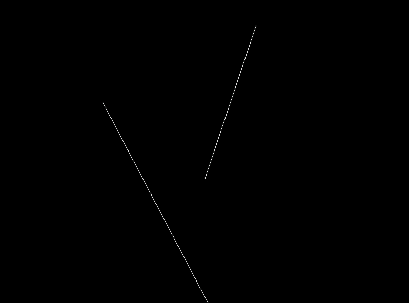
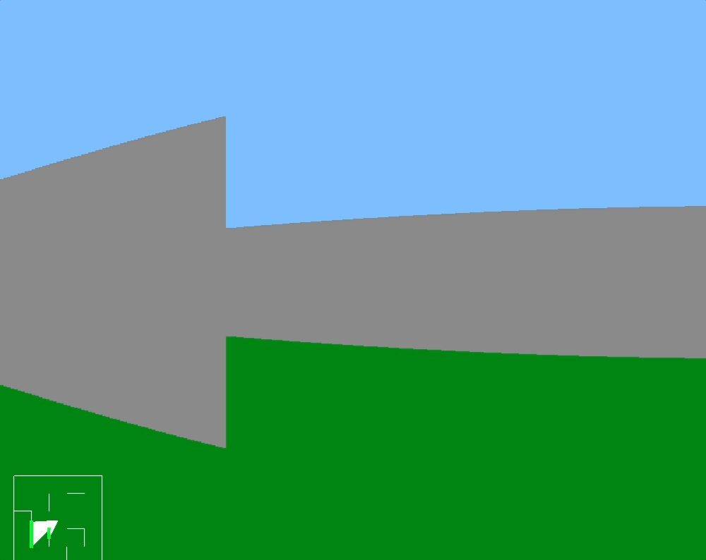

<!-- trunk-ignore-all(git-diff-check/error) -->
<!-- trunk-ignore-all(prettier) -->

# Simulating Raytracing and Raycasting in 2D

This project demonstrates **2D Raytracing** and **Raycasting** simulations using **OpenGL** and **GLUT** in **C++**. The program is divided into three parts, each handling a distinct unit of the simulation.

---

## Required Libraries

The following libraries are required to build and run the program:

1. **FreeGLUT** - OpenGL Utility Toolkit for rendering:
   - [FreeGLUT Documentation](http://freeglut.sourceforge.net/)
2. **GLEW** (Optional) - Manages OpenGL extensions:
   - [GLEW Documentation](http://glew.sourceforge.net/)

---

## Build and Run Instructions

### **Scripts Overview**

The project contains three scripts, each corresponding to a unit of the simulation:

- **`one.sh`**  
  Builds and runs the first unit of the program, which is stored in the `/builds/one` directory.

- **`two.sh`**  
  Builds and runs the second unit of the program, which is stored in the `/builds/two` directory.

- **`three.sh`**  
  Builds and runs the third unit of the program, which is stored in the `/builds/three` directory.

### **Steps to Run the Program**

1. **Clone the repository**:

   ```bash
   git clone https://github.com/ItsAash/comp342_raytracing
   cd comp342_raytracing
   ```

2. **Installing Dependencies**:
   For debain/ubuntu systems:

```bash
sudo apt-get install freeglut3 freeglut3-dev
```

For macOS:

```bash
brew install freeglut
```

3. **Make the script executable**:

```bash
  chmod +x one.sh two.sh three.sh
```

4. **Run the desired Unit**:

```bash
  ./one.sh
```

or

```bash
  ./two.sh
```

or

```bash
  ./three.sh
```

## Demonstration of the project

### _Unit 1: Raycasting Demo_

- The first unit simulates a basic **Ray**. It checks whether the ray intersects with the wall or not.
  

### _Unit 2: 2D Ray Casting_

- This unit simulate the source of the ray, emitting ray in all direction, and checking whether the ray intersects will any wall. This demonstration simulates the visibility of the ray is 0 beyond the wall.
  

### _Unit 3: 2D Raycasting for 3D World Generation_

- This unit simulates a 2D rays around the 2D world, and generate a 3D world based on the intersection of the Rays.
  

---

© **Ashish Neupane 2024**
